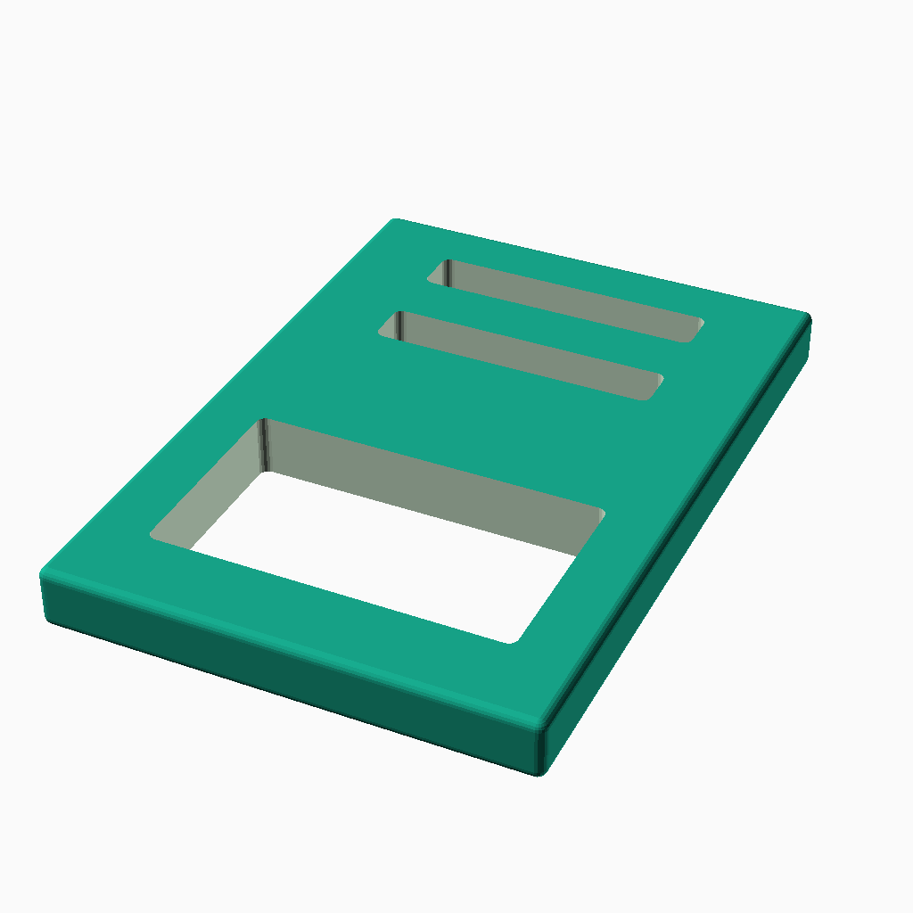
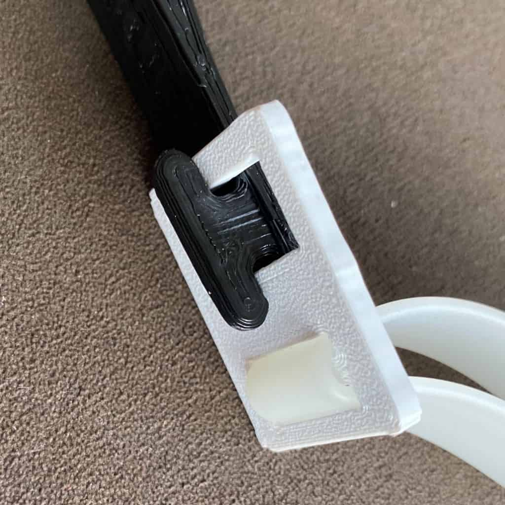

# Face Shield Strap Adapter

This is an adapter designed for the [Maker Nexus Prusa Face Shield Remix](https://github.com/makernexus/prusa-covid19-shield-remix) that makes it compatible with a continuously adjustable elastic strap that is approximately 15mm wide and 2mm thick. It is likely compatible with other face shield frame designs that use the same strap mount design like the [Prusa Face Shield](https://www.prusaprinters.org/prints/25857-prusa-face-shield).
